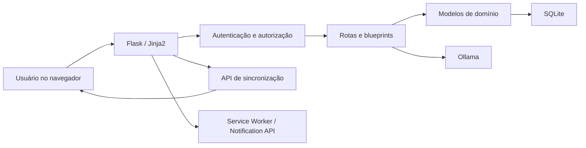

# Visão geral

## Finalidade

O Portal Corporativo é uma intranet corporativa para centralizar comunicação, conteúdo operacional, agenda, aplicativos internos, chamados de TI, indicadores e ferramentas administrativas. O portal atende colaboradores, recepção, gestão e administradores com níveis diferentes de acesso.

## Módulos funcionais

- Início com notícias, POPs, agenda, indicadores e atalhos de aplicativos.
- Pesquisa global em áreas, notícias, POPs, comunicados e aplicativos permitidos.
- Comunicados, pop-ups agendados e configuração das abas visíveis para usuários comuns.
- Central de notificações e notificações desktop.
- Notícias com texto, imagens e anexos.
- POPs com categorias, visualização, download e conteúdo pesquisável.
- Agenda corporativa, eventos e reservas de salas.
- Chat interno com remoção lógica e histórico administrativo.
- Hub de Apps com acesso por setor.
- Chamados de TI com local de trabalho, prioridade, responsável, resposta e status.
- Estoque de TI.
- Indicadores de atendimento importados de Excel, com histórico da base anterior.
- IA corporativa integrada ao Ollama e contextualizada por POPs, notícias e eventos.
- Auditoria, acessos, honeypot e administração de usuários e locais.
- Blueprints de Fiscal, RH, Gerador de RPA e RPA de Autônomos.

## Locais de trabalho

O modelo inicial possui:

- `SEDE`: unidade física principal.
- `FILIAL`: unidade filial genérica.
- `REMOTO`: local virtual/remoto.

Nenhum usuário ou registro antigo é classificado automaticamente. A associação é manual na administração de usuários. Um chamado novo herda o local atual do usuário; se não houver local, recebe escopo `nao_definido` e continua sendo criado normalmente.

## Princípios de operação

1. Preservar usuários, senhas, chamados, notícias, aplicativos, arquivos e históricos existentes.
2. Preferir mudanças aditivas de banco.
3. Não executar migrações automaticamente em produção.
4. Não incluir dados reais em releases ou repositórios.
5. Registrar alterações relevantes na auditoria.
6. Usar remoção lógica quando o histórico precisa permanecer disponível.
7. Não atribuir unidades, setores ou permissões a registros antigos sem decisão humana.

## Limites atuais

- O banco é SQLite; ele atende bem instalações pequenas e médias, mas escrita simultânea intensa deve motivar avaliação de PostgreSQL.
- A sincronização é quase em tempo real por polling, não por WebSocket.
- `app.py` ainda concentra diversas rotas e regras de orquestração.
- O servidor embutido do Flask é adequado para desenvolvimento e ambiente interno controlado; uma publicação de maior criticidade deve usar servidor WSGI e proxy reverso testados.
- Notificação desktop depende de permissão do navegador e de contexto seguro: HTTPS ou `localhost`.
- A IA depende de um Ollama externo disponível e do modelo configurado.

## Fluxo de alto nível

## Terminologia

- Papel: nível técnico de autorização (`comum`, `recepcao`, `admin`, `superadmin`).
- Setor: área organizacional usada em indicadores e acesso ao Hub de Apps.
- Gestor: admin, superadmin ou usuário cujo setor contém “gerencia”.
- Local de trabalho: Sede, filial ou Remoto.
- Escopo de unidade: `unidade`, `nao_definido` ou `compartilhado`.
- Remoção lógica: registro permanece no banco e recebe `excluido_em` ou flag equivalente.
